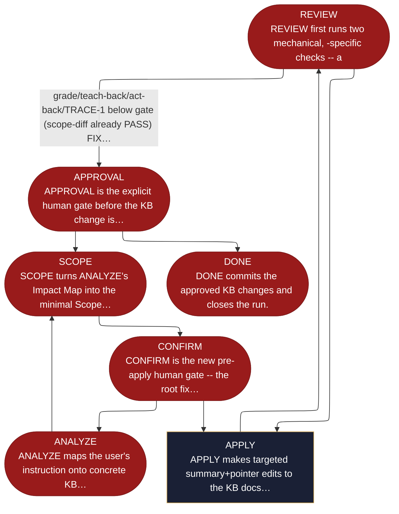

<!-- generated — do not edit; source: canonical/skills/aid-update-kb/SKILL.md -->

## Frontmatter

- **`name`** — aid-update-kb
- **`description`** — Optional on-demand targeted KB update skill. Isolates itself in its own worktree, analyzes how a free-form instruction lands in the Knowledge Base (an aid-researcher Impact Map), turns that into a minimal aid-architect Scope Plan traced to the instruction (+ an explicit Not-Changing list), and pauses for an explicit human CONFIRM before any edit. Applies only the confirmed scope, reviews it through f005's four-mandate panel (scoped to the changed docs), and commits only after a second explicit human approval. State-machine: ANALYZE -> SCOPE -> CONFIRM -> APPLY -> REVIEW -> APPROVAL -> DONE (FIX loop inside REVIEW).
- **`allowed-tools`** — Read, Glob, Grep, Bash, Write, Edit, Agent
- **`argument-hint`** — &lt;what changed / what to update in the KB>

[Definition: `canonical/skills/aid-update-kb/SKILL.md`](https://github.com/AndreVianna/aid-methodology/blob/master/canonical/skills/aid-update-kb/SKILL.md)

## Flow

