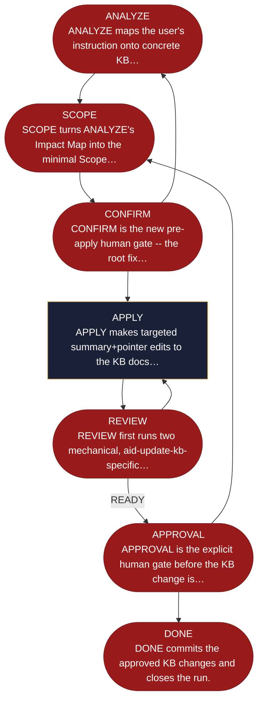

<!-- generated — do not edit; source: canonical/skills/aid-update-kb/SKILL.md -->

## Frontmatter

- **`name`** — aid-update-kb
- **`description`** — Apply one targeted, human-confirmed change to the Knowledge Base. Use this skill when you know what changed and which part of the KB should reflect it, and you want that edit and nothing more. It works in its own worktree: it analyses how your instruction lands across the KB, turns that into a minimal scope plan with an explicit list of what it will not change, and pauses for your confirmation before any edit. Only the confirmed scope is applied, it is reviewed against the four-mandate panel, and it commits only after you approve a second time.
- **`allowed-tools`** — Read, Glob, Grep, Bash, Write, Edit, Agent
- **`argument-hint`** — &lt;what changed / what to update in the KB>

[Definition: `canonical/skills/aid-update-kb/SKILL.md`](https://github.com/AndreVianna/aid-methodology/blob/master/canonical/skills/aid-update-kb/SKILL.md)

## Flow

## Source fragments

Every node in the chart above, in chart order, with the exact `canonical/` text it was derived from.

**1 · `ANALYZE`** — ANALYZE maps the user's instruction onto concrete KB… · _exit_ · PAUSE-FOR-USER-ACTION

~~~~plaintext title="canonical/skills/aid-update-kb/SKILL.md#L442" wrap
| ANALYZE | `references/state-analyze.md` | `aid-researcher` (clean-context dispatch, HL-8/AC-9) | CHAIN -> SCOPE (or PAUSE-FOR-USER-ACTION if a concept is un-groundable -- Q&A escalation to `.aid/knowledge/STATE.md`) |
~~~~

[Source: `canonical/skills/aid-update-kb/SKILL.md#L442`](https://github.com/AndreVianna/aid-methodology/blob/master/canonical/skills/aid-update-kb/SKILL.md#L442) · [full step: `canonical/skills/aid-update-kb/references/state-analyze.md#L1-L276`](https://github.com/AndreVianna/aid-methodology/blob/master/canonical/skills/aid-update-kb/references/state-analyze.md#L1-L276)

**2 · `SCOPE`** — SCOPE turns ANALYZE's Impact Map into the minimal Scope… · _exit_ · HALT

~~~~plaintext title="canonical/skills/aid-update-kb/SKILL.md#L443" wrap
| SCOPE | `references/state-scope.md` | `aid-architect` (clean-context dispatch, HL-8/AC-9) | CHAIN -> CONFIRM (or HALT if the Scope Plan is empty -- "no update needed") |
~~~~

[Source: `canonical/skills/aid-update-kb/SKILL.md#L443`](https://github.com/AndreVianna/aid-methodology/blob/master/canonical/skills/aid-update-kb/SKILL.md#L443) · [full step: `canonical/skills/aid-update-kb/references/state-scope.md#L1-L178`](https://github.com/AndreVianna/aid-methodology/blob/master/canonical/skills/aid-update-kb/references/state-scope.md#L1-L178)

**3 · `CONFIRM`** — CONFIRM is the new pre-apply human gate -- the root fix… · _exit_ · PAUSE-FOR-USER-ACTION

~~~~plaintext title="canonical/skills/aid-update-kb/SKILL.md#L444" wrap
| CONFIRM | `references/state-confirm.md` | inline (human gate) | `[1]` CHAIN -> APPLY; `[2]` PAUSE-FOR-USER-ACTION -> SCOPE/ANALYZE; `[3]` HALT |
~~~~

[Source: `canonical/skills/aid-update-kb/SKILL.md#L444`](https://github.com/AndreVianna/aid-methodology/blob/master/canonical/skills/aid-update-kb/SKILL.md#L444) · [full step: `canonical/skills/aid-update-kb/references/state-confirm.md#L1-L156`](https://github.com/AndreVianna/aid-methodology/blob/master/canonical/skills/aid-update-kb/references/state-confirm.md#L1-L156)

**4 · `APPLY`** — APPLY makes targeted summary+pointer edits to the KB docs… · _step_

~~~~plaintext title="canonical/skills/aid-update-kb/SKILL.md#L445" wrap
| APPLY | `references/state-apply.md` | inline (Edit) or `aid-architect`/`aid-researcher` for the owning doc-set | CHAIN -> REVIEW |
~~~~

[Source: `canonical/skills/aid-update-kb/SKILL.md#L445`](https://github.com/AndreVianna/aid-methodology/blob/master/canonical/skills/aid-update-kb/SKILL.md#L445) · [full step: `canonical/skills/aid-update-kb/references/state-apply.md#L1-L312`](https://github.com/AndreVianna/aid-methodology/blob/master/canonical/skills/aid-update-kb/references/state-apply.md#L1-L312)

**5 · `REVIEW`** — REVIEW first runs two mechanical, aid-update-kb-specific… · _exit_ · PAUSE-FOR-USER-ACTION

~~~~plaintext title="canonical/skills/aid-update-kb/SKILL.md#L446" wrap
| REVIEW | `references/state-review.md` (REUSES f005's panel scoped to the changed docs; scope-diff guard runs first) | `aid-reviewer` panel (f005) | 4 outcomes (`state-review.md § Step 4`): incomplete APPLY -> CHAIN -> APPLY; out-of-scope disk edit -> PAUSE-FOR-USER-ACTION -> CONFIRM; grade/teach-back/act-back/TRACE-1 below gate (scope-diff already PASS) -> CHAIN -> FIX; READY -> CHAIN -> APPROVAL |
~~~~

[Source: `canonical/skills/aid-update-kb/SKILL.md#L446`](https://github.com/AndreVianna/aid-methodology/blob/master/canonical/skills/aid-update-kb/SKILL.md#L446) · [full step: `canonical/skills/aid-update-kb/references/state-review.md#L1-L414`](https://github.com/AndreVianna/aid-methodology/blob/master/canonical/skills/aid-update-kb/references/state-review.md#L1-L414)

**6 · `APPROVAL`** — APPROVAL is the explicit human gate before the KB change is… · _exit_ · PAUSE-FOR-USER-ACTION

~~~~plaintext title="canonical/skills/aid-update-kb/SKILL.md#L447" wrap
| APPROVAL | `references/state-approval.md` | inline | `[1] Approved` -> CHAIN -> DONE; `[2] Additional consideration` -> PAUSE-FOR-USER-ACTION -> re-scope (CONFIRM/SCOPE) |
~~~~

[Source: `canonical/skills/aid-update-kb/SKILL.md#L447`](https://github.com/AndreVianna/aid-methodology/blob/master/canonical/skills/aid-update-kb/SKILL.md#L447) · [full step: `canonical/skills/aid-update-kb/references/state-approval.md#L1-L155`](https://github.com/AndreVianna/aid-methodology/blob/master/canonical/skills/aid-update-kb/references/state-approval.md#L1-L155)

**7 · `DONE`** — DONE commits the approved KB changes and closes the run. · _exit_ · HALT

~~~~plaintext title="canonical/skills/aid-update-kb/SKILL.md#L448" wrap
| DONE | `references/state-done.md` | inline | HALT (restamp `approved_at_commit:`, commit on the Pre-flight worktree's `aid/update-kb-<ts>` branch, clean run-state) |
~~~~

[Source: `canonical/skills/aid-update-kb/SKILL.md#L448`](https://github.com/AndreVianna/aid-methodology/blob/master/canonical/skills/aid-update-kb/SKILL.md#L448) · [full step: `canonical/skills/aid-update-kb/references/state-done.md#L1-L239`](https://github.com/AndreVianna/aid-methodology/blob/master/canonical/skills/aid-update-kb/references/state-done.md#L1-L239)
