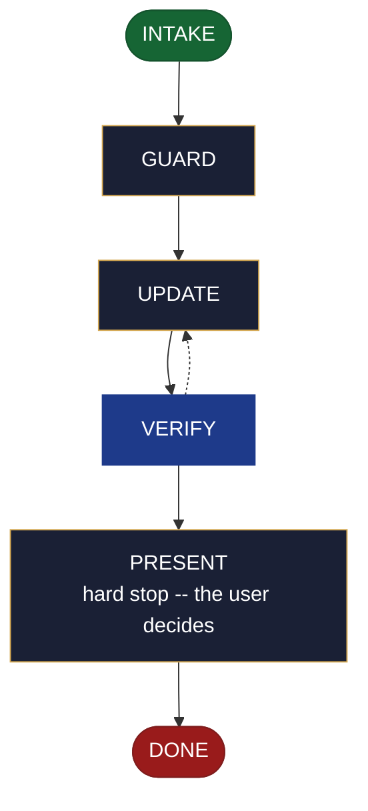

<!-- generated — do not edit; source: canonical/skills/aid-update-mvp/SKILL.md -->

## Frontmatter

- **`name`** — aid-update-mvp
- **`description`** — Revise roadmap.md's ## MVP section only -- the first shippable slice: its contents, the line reasoning, what was cut, and its Status field (including the transition to Shipped &lt;version>). Use this skill when the MVP section already carries committed content and its scope has changed. May create the ## MVP section if roadmap.md exists without one. Reads and consumes an MVP seed when one is present in .aid/design/; never requires one. Asks every run which previously created outputs to update alongside it -- no stored list, no tracking metadata written. Everything outside ## MVP belongs to /aid-update-roadmap. When roadmap.md is absent, routes to /aid-create-roadmap without writing anything.
- **`allowed-tools`** — Read, Glob, Grep, Bash, Write, Edit, Agent
- **`argument-hint`** — [&lt;slice>] -- what to revise in the MVP section (contents, line, cuts, status)

[Definition: `canonical/skills/aid-update-mvp/SKILL.md`](https://github.com/AndreVianna/aid-methodology/blob/master/canonical/skills/aid-update-mvp/SKILL.md)

## Flow

## Source fragments

Every node in the chart above, in chart order, with the exact `canonical/` text it was derived from.

**1 · `INTAKE`** · _entry_

~~~~plaintext title="canonical/skills/aid-update-mvp/SKILL.md#L43-L60" wrap
## State: INTAKE

1. **Require a subject.** Empty argument -> ask one bootstrapping question ("What would
   you like to revise in the MVP section -- slice contents, the line reasoning, cuts, or
   status?") and wait.
2. **Allocate, exactly per `design-lifecycle.md § Skill shape -- Allocation`** -- the Work
   Initiation Gate, then `initiator: aid-update-mvp`, `active_skill: aid-update-mvp`,
   `pipeline.path: lite`, `lifecycle: Running`. `phase` is not driven.
3. **Read the destination** at `.aid/knowledge/roadmap.md`. If absent, **route** to
   `/aid-create-roadmap` -- name it explicitly in the response -- and write nothing.
   Set `lifecycle: Paused-Awaiting-Input`. Advance to DONE without proceeding further.
4. **Read the seed** at `.aid/design/mvp.md` if one exists. Note its presence or absence;
   do not require it.
5. **Ask the derived-outputs question** -- every run, unconditionally: "Which previously
   created outputs should be updated alongside the MVP section?" Wait for the user's
   answer before proceeding. Write no stored list and no tracking metadata anywhere.
6. **Classify complexity (model + effort)** for the `aid-architect` dispatch below;
   verifier tier >= producer tier (`agent-dispatch-tiering.md`).
~~~~

[Source: `canonical/skills/aid-update-mvp/SKILL.md#L43-L60`](https://github.com/AndreVianna/aid-methodology/blob/master/canonical/skills/aid-update-mvp/SKILL.md#L43-L60) · [full step: `canonical/skills/aid-update-mvp/SKILL.md#L43-L62`](https://github.com/AndreVianna/aid-methodology/blob/master/canonical/skills/aid-update-mvp/SKILL.md#L43-L62)

**2 · `GUARD`** · _step_

~~~~plaintext title="canonical/skills/aid-update-mvp/SKILL.md#L66-L69" wrap
## State: GUARD

**Readiness gate (class-1 contract, feature-002 §3b).** Only applies when a seed was
found in INTAKE.
~~~~

[Source: `canonical/skills/aid-update-mvp/SKILL.md#L66-L69`](https://github.com/AndreVianna/aid-methodology/blob/master/canonical/skills/aid-update-mvp/SKILL.md#L66-L69) · [full step: `canonical/skills/aid-update-mvp/SKILL.md#L66-L78`](https://github.com/AndreVianna/aid-methodology/blob/master/canonical/skills/aid-update-mvp/SKILL.md#L66-L78)

**3 · `UPDATE`** · _step_

~~~~plaintext title="canonical/skills/aid-update-mvp/SKILL.md#L82-L90" wrap
## State: UPDATE

Dispatch **`aid-architect`** (clean context, tiered) to revise the `## MVP` section.
Apply the **byte-range write discipline** (`feature-003 §4`, feature-002 §3c *Mechanics*):
read the whole `roadmap.md` file, identify the `## MVP` byte range (the literal heading
`## MVP`, matched exactly, through to the next heading of level 2 or shallower, or EOF),
replace only that range with the new content, and write the file back with every byte
outside that range **byte-identical** -- no reformatting, no whitespace change, no
re-ordering of any other region.
~~~~

[Source: `canonical/skills/aid-update-mvp/SKILL.md#L82-L90`](https://github.com/AndreVianna/aid-methodology/blob/master/canonical/skills/aid-update-mvp/SKILL.md#L82-L90) · [full step: `canonical/skills/aid-update-mvp/SKILL.md#L82-L121`](https://github.com/AndreVianna/aid-methodology/blob/master/canonical/skills/aid-update-mvp/SKILL.md#L82-L121)

**4 · `VERIFY`** · _loop-back_

~~~~plaintext title="canonical/skills/aid-update-mvp/SKILL.md#L125-L129" wrap
## State: VERIFY

**Full verify** -- exactly as `design-lifecycle.md § Skill shape -- "Full verify"`
defines it. Not clean -> loop to UPDATE; the circuit-breaker there governs escalation
to IMPEDIMENT + `lifecycle: Blocked`.
~~~~

[Source: `canonical/skills/aid-update-mvp/SKILL.md#L125-L129`](https://github.com/AndreVianna/aid-methodology/blob/master/canonical/skills/aid-update-mvp/SKILL.md#L125-L129) · [full step: `canonical/skills/aid-update-mvp/SKILL.md#L125-L131`](https://github.com/AndreVianna/aid-methodology/blob/master/canonical/skills/aid-update-mvp/SKILL.md#L125-L131)

**5 · `PRESENT`** — hard stop -- the user decides · _step_

~~~~plaintext title="canonical/skills/aid-update-mvp/SKILL.md#L135-L138" wrap
## State: PRESENT (hard stop -- the user decides)

Set `lifecycle: Paused-Awaiting-Input`. Present the revised `## MVP` section clearly.
Assert:
~~~~

[Source: `canonical/skills/aid-update-mvp/SKILL.md#L135-L138`](https://github.com/AndreVianna/aid-methodology/blob/master/canonical/skills/aid-update-mvp/SKILL.md#L135-L138) · [full step: `canonical/skills/aid-update-mvp/SKILL.md#L135-L151`](https://github.com/AndreVianna/aid-methodology/blob/master/canonical/skills/aid-update-mvp/SKILL.md#L135-L151)

**6 · `DONE`** · _exit_ · UNSPECIFIED

~~~~plaintext title="canonical/skills/aid-update-mvp/SKILL.md#L155-L157" wrap
## State: DONE

Set `lifecycle: Completed`, `updated` now, append a `## Lifecycle History` row.
~~~~

[Source: `canonical/skills/aid-update-mvp/SKILL.md#L155-L157`](https://github.com/AndreVianna/aid-methodology/blob/master/canonical/skills/aid-update-mvp/SKILL.md#L155-L157) · [full step: `canonical/skills/aid-update-mvp/SKILL.md#L155-L157`](https://github.com/AndreVianna/aid-methodology/blob/master/canonical/skills/aid-update-mvp/SKILL.md#L155-L157)
