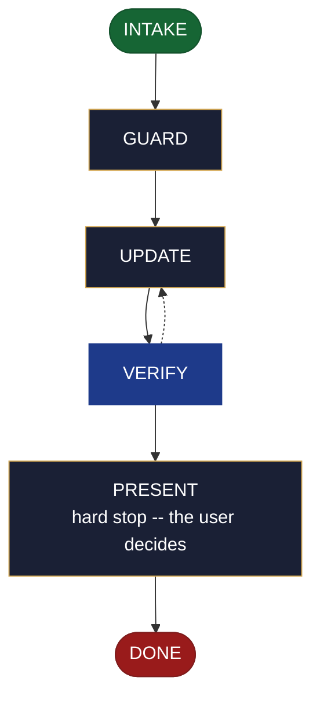

<!-- generated — do not edit; source: canonical/skills/aid-update-roadmap/SKILL.md -->

## Frontmatter

- **`name`** — aid-update-roadmap
- **`description`** — Revise roadmap.md's direction entries outside the ## MVP section -- add, revise or supersede direction entries, and move an entry between horizon sections (## Now, ## Next, ## Later). Use this skill when the roadmap already exists and something has moved between horizons. Reads and consumes a roadmap seed when one is present in `.aid/design/`; never requires one. Asks every run which previously created outputs to update alongside it -- no stored list, no tracking metadata written. The ## MVP section belongs entirely to `/aid-update-mvp` -- this skill never touches it and leaves the ## Contents MVP index entry in place whether or not the section exists. When roadmap.md is absent, routes to `/aid-create-roadmap` without writing anything.
- **`allowed-tools`** — Read, Glob, Grep, Bash, Write, Edit, Agent
- **`argument-hint`** — [&lt;direction>] -- what to revise (entries to add, update, supersede, or move)

[Definition: `canonical/skills/aid-update-roadmap/SKILL.md`](https://github.com/AndreVianna/aid-methodology/blob/master/canonical/skills/aid-update-roadmap/SKILL.md)

## Flow

## Source fragments

Every node in the chart above, in chart order, with the exact `canonical/` text it was derived from.

**1 · `INTAKE`** · _entry_

~~~~plaintext title="canonical/skills/aid-update-roadmap/SKILL.md#L37-L55" wrap
## State: INTAKE

1. **Require a subject.** Empty argument -> ask one bootstrapping question ("What would
   you like to revise in the roadmap -- entries to add, update, supersede, or move between
   horizons?") and wait.
2. **Allocate, exactly per `design-lifecycle.md § Skill shape -- Allocation`** -- the Work
   Initiation Gate, then `initiator: aid-update-roadmap`, `active_skill:
   aid-update-roadmap`, `pipeline.path: lite`, `lifecycle: Running`. `phase` is not
   driven.
3. **Read the destination** at `.aid/knowledge/roadmap.md`. If absent, **route** to
   `/aid-create-roadmap` -- name it explicitly in the response -- and write nothing.
   Set `lifecycle: Paused-Awaiting-Input`. Advance to DONE without proceeding further.
4. **Read the seed** at `.aid/design/roadmap.md` if one exists. Note its presence or
   absence; do not require it.
5. **Ask the derived-outputs question** -- every run, unconditionally: "Which previously
   created outputs should be updated alongside roadmap.md?" Wait for the user's answer
   before proceeding. Write no stored list and no tracking metadata anywhere.
6. **Classify complexity (model + effort)** for the `aid-architect` dispatch below;
   verifier tier >= producer tier (`agent-dispatch-tiering.md`).
~~~~

[Source: `canonical/skills/aid-update-roadmap/SKILL.md#L37-L55`](https://github.com/AndreVianna/aid-methodology/blob/master/canonical/skills/aid-update-roadmap/SKILL.md#L37-L55) · [full step: `canonical/skills/aid-update-roadmap/SKILL.md#L37-L57`](https://github.com/AndreVianna/aid-methodology/blob/master/canonical/skills/aid-update-roadmap/SKILL.md#L37-L57)

**2 · `GUARD`** · _step_

~~~~plaintext title="canonical/skills/aid-update-roadmap/SKILL.md#L61-L64" wrap
## State: GUARD

**Readiness gate (class-1 contract, feature-002 §3b).** Only applies when a seed was
found in INTAKE.
~~~~

[Source: `canonical/skills/aid-update-roadmap/SKILL.md#L61-L64`](https://github.com/AndreVianna/aid-methodology/blob/master/canonical/skills/aid-update-roadmap/SKILL.md#L61-L64) · [full step: `canonical/skills/aid-update-roadmap/SKILL.md#L61-L73`](https://github.com/AndreVianna/aid-methodology/blob/master/canonical/skills/aid-update-roadmap/SKILL.md#L61-L73)

**3 · `UPDATE`** · _step_

~~~~plaintext title="canonical/skills/aid-update-roadmap/SKILL.md#L77-L83" wrap
## State: UPDATE

Dispatch **`aid-architect`** (clean context, tiered) to revise the document. Apply
the **byte-range write discipline** (§4, feature-003): read the whole `roadmap.md` file,
modify only the bytes in the owned region (everything except the `## MVP` byte range and
`## Contents`), and write the file back with every byte outside the owned region
**byte-identical** -- no reformatting, no whitespace change, no re-ordering.
~~~~

[Source: `canonical/skills/aid-update-roadmap/SKILL.md#L77-L83`](https://github.com/AndreVianna/aid-methodology/blob/master/canonical/skills/aid-update-roadmap/SKILL.md#L77-L83) · [full step: `canonical/skills/aid-update-roadmap/SKILL.md#L77-L112`](https://github.com/AndreVianna/aid-methodology/blob/master/canonical/skills/aid-update-roadmap/SKILL.md#L77-L112)

**4 · `VERIFY`** · _loop-back_

~~~~plaintext title="canonical/skills/aid-update-roadmap/SKILL.md#L116-L120" wrap
## State: VERIFY

**Full verify** -- exactly as `design-lifecycle.md § Skill shape -- "Full verify"`
defines it. Not clean -> loop to UPDATE; the circuit-breaker there governs escalation
to IMPEDIMENT + `lifecycle: Blocked`.
~~~~

[Source: `canonical/skills/aid-update-roadmap/SKILL.md#L116-L120`](https://github.com/AndreVianna/aid-methodology/blob/master/canonical/skills/aid-update-roadmap/SKILL.md#L116-L120) · [full step: `canonical/skills/aid-update-roadmap/SKILL.md#L116-L122`](https://github.com/AndreVianna/aid-methodology/blob/master/canonical/skills/aid-update-roadmap/SKILL.md#L116-L122)

**5 · `PRESENT`** — hard stop -- the user decides · _step_

~~~~plaintext title="canonical/skills/aid-update-roadmap/SKILL.md#L126-L128" wrap
## State: PRESENT (hard stop -- the user decides)

Set `lifecycle: Paused-Awaiting-Input`. Present the revised document clearly. Assert:
~~~~

[Source: `canonical/skills/aid-update-roadmap/SKILL.md#L126-L128`](https://github.com/AndreVianna/aid-methodology/blob/master/canonical/skills/aid-update-roadmap/SKILL.md#L126-L128) · [full step: `canonical/skills/aid-update-roadmap/SKILL.md#L126-L137`](https://github.com/AndreVianna/aid-methodology/blob/master/canonical/skills/aid-update-roadmap/SKILL.md#L126-L137)

**6 · `DONE`** · _exit_ · UNSPECIFIED

~~~~plaintext title="canonical/skills/aid-update-roadmap/SKILL.md#L141-L143" wrap
## State: DONE

Set `lifecycle: Completed`, `updated` now, append a `## Lifecycle History` row.
~~~~

[Source: `canonical/skills/aid-update-roadmap/SKILL.md#L141-L143`](https://github.com/AndreVianna/aid-methodology/blob/master/canonical/skills/aid-update-roadmap/SKILL.md#L141-L143) · [full step: `canonical/skills/aid-update-roadmap/SKILL.md#L141-L143`](https://github.com/AndreVianna/aid-methodology/blob/master/canonical/skills/aid-update-roadmap/SKILL.md#L141-L143)
