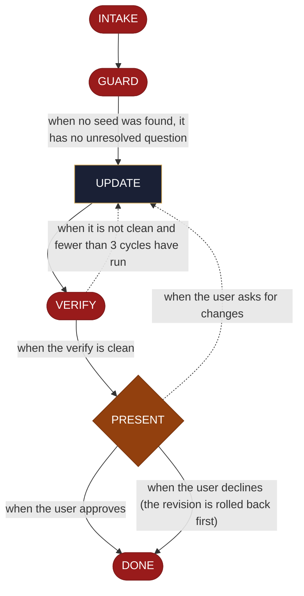

<!-- generated — do not edit; source: canonical/skills/aid-update-roadmap/SKILL.md -->

## Frontmatter

- **`name`** — aid-update-roadmap
- **`description`** — Revise roadmap.md's direction entries outside the ## MVP section -- add, revise or supersede direction entries, and move an entry between horizon sections (## Now, ## Next, ## Later). Use this skill when the roadmap already exists and something has moved between horizons. Reads and consumes a roadmap seed when one is present in `.aid/design/`; never requires one. Asks every run which previously created outputs to update alongside it -- no stored list, no tracking metadata written. The ## MVP section belongs entirely to `/aid-update-mvp` -- this skill never touches it and leaves the ## Contents MVP index entry in place whether or not the section exists. When roadmap.md is absent, routes to `/aid-create-roadmap` without writing anything.
- **`allowed-tools`** — Read Glob Grep Bash Shell Terminal Write Edit Agent
- **`argument-hint`** — [&lt;direction>] -- what to revise (entries to add, update, supersede, or move)

[Definition: `canonical/skills/aid-update-roadmap/SKILL.md`](https://github.com/AndreVianna/aid-methodology/blob/master/canonical/skills/aid-update-roadmap/SKILL.md)

## Flow

```mermaid
flowchart TB
  classDef aidNode color:#fff
  classDef aidEntry fill:#166534,stroke:#14532d,color:#fff
  classDef aidExit fill:#991b1b,stroke:#7f1d1d,color:#fff
  classDef aidDecision fill:#92400e,stroke:#78350f,color:#fff
  classDef aidLoopBack fill:#1e3a8a,stroke:#1e3a8a,color:#fff
  classDef aidStep fill:#1a2035,stroke:#d4a853,color:#f1f5f9
  n1(["INTAKE"])
  n2(["GUARD"])
  n3["UPDATE"]
  n4(["VERIFY"])
  n5{"PRESENT"}
  n6(["DONE"])
  n1 --> n2
  n2 -->|"when no seed was found, it has no unresolved question"| n3
  n3 --> n4
  n4 -. "when it is not clean and fewer than 3 cycles have run" .-> n3
  n4 -->|"when the verify is clean"| n5
  n5 -. "when the user asks for changes" .-> n3
  n5 -->|"when the user approves"| n6
  n5 -->|"when the user declines (the revision is rolled back first)"| n6
  class n1 aidExit
  class n2 aidExit
  class n3 aidStep
  class n4 aidExit
  class n5 aidDecision
  class n6 aidExit
  class n1 aidNode
  class n2 aidNode
  class n3 aidNode
  class n4 aidNode
  class n5 aidNode
  class n6 aidNode
```
## Source fragments

Every node in the chart above, in chart order, with the exact `canonical/` text it was derived from.

**1 · `INTAKE`** · _exit_ · HALT

~~~~plaintext title="canonical/skills/aid-update-roadmap/SKILL.md#L50-L67" wrap
## State: INTAKE

1. **Require a subject.** Empty argument -> ask one bootstrapping question ("What would
   you like to revise in the roadmap -- entries to add, update, supersede, or move between
   horizons?") and wait.
2. **Read the destination** at `.aid/knowledge/roadmap.md`. If absent, **route**: allocate nothing and
   write nothing, name `/aid-create-roadmap` explicitly in the response, and end the run.
3. **Read the seed** at `.aid/design/roadmap.md` if one exists. Note its presence or
   absence; do not require it.
4. **Ask the derived-outputs question** -- every run, unconditionally: "Which previously
   created outputs should be updated alongside roadmap.md?" Wait for the user's answer
   before proceeding. Write no stored list and no tracking metadata anywhere.
5. **Classify complexity (model + effort)** for the `aid-architect` dispatch below;
   verifier tier >= producer tier (`agent-dispatch-tiering.md`).
6. **Allocate** once the destination is present, so a route leaves no work behind, exactly per
   `design-lifecycle.md § Skill shape -- Allocation`: the Work Initiation Gate, with
   `initiator: aid-update-roadmap`, `--path lite` and the saved step `GUARD` (INTAKE runs before the
   record and saves nothing), and `--seed .aid/design/roadmap.md` on the gate's `--create` when that seed exists (the gate adds it to the work's `sources:` and copies its `## Questions` into the work's record). `phase` is not driven.
~~~~

[Source: `canonical/skills/aid-update-roadmap/SKILL.md#L50-L67`](https://github.com/AndreVianna/aid-methodology/blob/master/canonical/skills/aid-update-roadmap/SKILL.md#L50-L67) · [full step: `canonical/skills/aid-update-roadmap/SKILL.md#L50-L72`](https://github.com/AndreVianna/aid-methodology/blob/master/canonical/skills/aid-update-roadmap/SKILL.md#L50-L72)

**2 · `GUARD`** · _exit_ · HALT

~~~~plaintext title="canonical/skills/aid-update-roadmap/SKILL.md#L76-L79" wrap
## State: GUARD

**Readiness gate (class-1 contract, feature-002 §3b).** Only applies when a seed was
found in INTAKE.
~~~~

[Source: `canonical/skills/aid-update-roadmap/SKILL.md#L76-L79`](https://github.com/AndreVianna/aid-methodology/blob/master/canonical/skills/aid-update-roadmap/SKILL.md#L76-L79) · [full step: `canonical/skills/aid-update-roadmap/SKILL.md#L76-L89`](https://github.com/AndreVianna/aid-methodology/blob/master/canonical/skills/aid-update-roadmap/SKILL.md#L76-L89)

**3 · `UPDATE`** · _step_

~~~~plaintext title="canonical/skills/aid-update-roadmap/SKILL.md#L93-L99" wrap
## State: UPDATE

**Before the first edit,** copy every file this step will edit or delete (the destination, each output the user
named in INTAKE, a consumed seed and, for a promotion, `tech-debt.md`) into `rollback/` in the work folder, under the same
relative path, so PRESENT can restore them if the user declines. Copy only once: when UPDATE runs
again (after VERIFY or a requested change), a file already under `rollback/` is kept, so a decline restores
the original, not an earlier revision.
~~~~

[Source: `canonical/skills/aid-update-roadmap/SKILL.md#L93-L99`](https://github.com/AndreVianna/aid-methodology/blob/master/canonical/skills/aid-update-roadmap/SKILL.md#L93-L99) · [full step: `canonical/skills/aid-update-roadmap/SKILL.md#L93-L134`](https://github.com/AndreVianna/aid-methodology/blob/master/canonical/skills/aid-update-roadmap/SKILL.md#L93-L134)

**4 · `VERIFY`** · _exit_ · HALT

~~~~plaintext title="canonical/skills/aid-update-roadmap/SKILL.md#L138-L142" wrap
## State: VERIFY

**Full verify** -- exactly as `design-lifecycle.md § Skill shape -- "Full verify"`
defines it. Not clean -> loop to UPDATE; the circuit-breaker there governs escalation
to IMPEDIMENT + `lifecycle: Blocked`.
~~~~

[Source: `canonical/skills/aid-update-roadmap/SKILL.md#L138-L142`](https://github.com/AndreVianna/aid-methodology/blob/master/canonical/skills/aid-update-roadmap/SKILL.md#L138-L142) · [full step: `canonical/skills/aid-update-roadmap/SKILL.md#L138-L144`](https://github.com/AndreVianna/aid-methodology/blob/master/canonical/skills/aid-update-roadmap/SKILL.md#L138-L144)

**5 · `PRESENT`** — hard stop -- the user decides · _decision_

~~~~plaintext title="canonical/skills/aid-update-roadmap/SKILL.md#L148-L150" wrap
## State: PRESENT (hard stop -- the user decides)

Present the revised document clearly. Assert:
~~~~

[Source: `canonical/skills/aid-update-roadmap/SKILL.md#L148-L150`](https://github.com/AndreVianna/aid-methodology/blob/master/canonical/skills/aid-update-roadmap/SKILL.md#L148-L150) · [full step: `canonical/skills/aid-update-roadmap/SKILL.md#L148-L170`](https://github.com/AndreVianna/aid-methodology/blob/master/canonical/skills/aid-update-roadmap/SKILL.md#L148-L170)

**6 · `DONE`** · _exit_ · HALT

~~~~plaintext title="canonical/skills/aid-update-roadmap/SKILL.md#L174-L176" wrap
## State: DONE

Set `lifecycle` to `Completed` through the writer (`--pipeline --field Lifecycle --value Completed`), which also clears the saved skill and step.
~~~~

[Source: `canonical/skills/aid-update-roadmap/SKILL.md#L174-L176`](https://github.com/AndreVianna/aid-methodology/blob/master/canonical/skills/aid-update-roadmap/SKILL.md#L174-L176) · [full step: `canonical/skills/aid-update-roadmap/SKILL.md#L174-L178`](https://github.com/AndreVianna/aid-methodology/blob/master/canonical/skills/aid-update-roadmap/SKILL.md#L174-L178)
