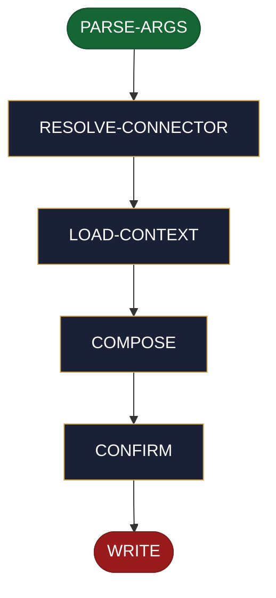

<!-- generated — do not edit; source: canonical/skills/aid-update-ticket/SKILL.md -->

## Frontmatter

- **`name`** — aid-update-ticket
- **`description`** — On-demand write skill that mutates exactly ONE named part of an existing ticket in whatever issue-tracker connector resolves for it: `aid-update-ticket <part> [<connector>:]<ticket-id> <content>` where `part` is the closed enum `description | comment | status`. `description` REPLACES the field, `comment` APPENDS a new comment, `status` SETS the ticket's state. Resolves the connector via the shared ticket-resolution ladder, loads whatever context the named part needs (status: the ticket's available transitions; description: its current value for a before/after preview; comment: nothing), composes the exact mutation, and shows it in an in-invocation `AskUserQuestion` confirm before the single host-MCP write. A `status` target is validated against the tracker's available transitions when the MCP can enumerate them (a mismatch lists the valid options and stops before the confirm gate); when transitions cannot be enumerated, the transition is attempted and the tracker's own error is surfaced verbatim on rejection. Never writes silently, and an MCP failure never leaves a partial write.
- **`allowed-tools`** — Read, Glob, Grep, AskUserQuestion
- **`argument-hint`** — &lt;part> [&lt;connector>:]&lt;ticket-id> &lt;content>

[Definition: `canonical/skills/aid-update-ticket/SKILL.md`](https://github.com/AndreVianna/aid-methodology/blob/master/canonical/skills/aid-update-ticket/SKILL.md)

## Flow

> **Approximate:** This chart is derived by heuristic; exact transitions may differ from runtime behaviour.

